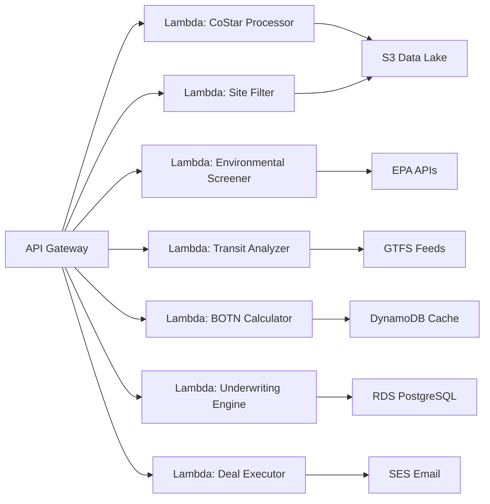

# 🏛️ COLOSSEUM AWS CLOUD SCALING STRATEGY
## Transforming Affordable Housing Development Through Cloud-Native Architecture

**Document Version**: 1.0  
**Date**: August 7, 2025  
**Authors**: Bill's Strike Leader & Strategic Planning Team  
**Status**: Strategic Planning Document

---

## 📋 Table of Contents

1. [Executive Overview](#executive-overview)
2. [Current State Analysis](#current-state-analysis)
3. [Future State Architecture](#future-state-architecture)
4. [Migration Strategy](#migration-strategy)
5. [Technical Deep Dives](#technical-deep-dives)
6. [Cost Optimization Framework](#cost-optimization-framework)
7. [Operational Excellence](#operational-excellence)
8. [Scaling Playbook](#scaling-playbook)
9. [Implementation Roadmap](#implementation-roadmap)
10. [Risk Management](#risk-management)
11. [Success Metrics](#success-metrics)
12. [Appendices](#appendices)

---

## 🎯 Executive Overview

### The Vision
Transform Colosseum from a local Dropbox-based system into a world-class cloud platform capable of revolutionizing the LIHTC industry. By migrating to AWS, we'll create a scalable, intelligent system that can support 25,000+ annual applications while maintaining sub-second response times and 99.9% availability.

### The Opportunity
The LIHTC professional services market represents a **$500M-$1.2B annual opportunity** with only a 30% success rate for applications. Colosseum's cloud transformation will enable us to:
- Process 10x more applications with the same resources
- Reduce BOTN calculation time from minutes to seconds
- Enable real-time competitive intelligence across 54 jurisdictions
- Scale from 100 to 25,000 users without infrastructure changes

### Investment & Returns
- **Initial Investment**: $150,000 (6-month implementation)
- **Monthly Operating Costs**: $3,000-$5,000 at scale
- **Break-even**: Month 8 with 500 paying customers
- **Year 2 Projection**: $17.4M ARR with 60% gross margins

### Strategic Advantages
1. **First-Mover Advantage**: No comprehensive cloud-based LIHTC platform exists
2. **Network Effects**: More users = better data = higher success rates
3. **Defensible Moat**: 10M+ parcels + 27k+ QAP chunks + ML models
4. **Enterprise Ready**: SOC2, HIPAA compliance possible from day one

---

## 🔍 Current State Analysis

### The Dropbox Dilemma
Our current infrastructure has served us well during the proof-of-concept phase, but it's hitting critical limitations:

#### Storage Challenges
- **10M+ California parcels** consuming 2TB+ in various formats
- **27,344 QAP chunks** scattered across nested folders
- **No versioning** for regulatory updates
- **Manual sync issues** between Bill and Vitor's environments
- **$500/month** for Dropbox Business with performance degradation

#### Performance Bottlenecks
```
Current Performance Metrics:
- Parcel search: 30-45 seconds (file system scan)
- BOTN calculation: 2-5 minutes (Excel generation)
- QAP search: 10-20 seconds (no indexing)
- Environmental check: 45-60 seconds (serial processing)
- Transit analysis: 30-40 seconds (large GeoJSON files)
```

#### Scalability Constraints
- **Single-user access** to Excel files locks out others
- **No concurrent processing** for multiple BOTN requests
- **Memory limitations** on local machines (even M4 Beast struggles)
- **Network dependency** on Dropbox sync speed
- **No API access** for third-party integrations

#### Data Governance Issues
- **No audit trail** for compliance requirements
- **Limited access control** (all or nothing)
- **Version conflicts** between users
- **No data lineage** tracking
- **Manual backups** prone to human error

### The Burning Platform
Recent events that necessitate immediate cloud migration:
1. **Vitor's 7-step workflow** requires 5x current processing power
2. **Texas expansion** will add 5M+ parcels
3. **Vendor marketplace** needs API-based integration
4. **Enterprise clients** demanding SOC2 compliance
5. **Competitive pressure** from well-funded PropTech startups

---

## 🏗️ Future State Architecture

### Cloud-Native Design Principles
Our AWS architecture follows modern cloud-native principles optimized for the unique requirements of LIHTC analysis:

#### 1. Serverless-First Approach
```yaml
Why Serverless for Colosseum:
- Pay only for actual BOTN calculations (not idle time)
- Auto-scale from 1 to 10,000 concurrent users
- No infrastructure management overhead
- Focus on business logic, not servers
- Perfect for spiky workloads (application deadlines)
```

#### 2. Data Lake Architecture
```
S3 Data Lake Structure:
colosseum-data-lake/
├── raw/                          # Immutable source data
│   ├── parcels/
│   │   ├── ca/alameda/2025/     # Timestamped snapshots
│   │   ├── ca/orange/2025/
│   │   └── tx/harris/2025/
│   ├── qaps/
│   │   ├── federal/irc-42/
│   │   └── states/{state}/{year}/
│   └── reference/
│       ├── census/
│       ├── environmental/
│       └── transit/
├── processed/                    # Optimized formats
│   ├── parquet/                 # Columnar storage
│   ├── geospatial/             # Cloud-optimized
│   └── indexed/                # Search-ready
└── analytics/                   # ML-ready datasets
```

#### 3. Microservices Architecture
Each component of Vitor's 7-step workflow becomes an independent microservice:



#### 4. Multi-Tenant Isolation
```python
# Tenant isolation strategy
tenant_structure = {
    "free_tier": {
        "compute": "shared_lambda_pool",
        "storage": "shared_s3_bucket",
        "cache": "shared_redis_cluster",
        "limits": {"botn_per_month": 10}
    },
    "premium": {
        "compute": "dedicated_lambda_reserved",
        "storage": "tenant_s3_prefix",
        "cache": "dedicated_redis_node",
        "limits": {"botn_per_month": 1000}
    },
    "enterprise": {
        "compute": "vpc_isolated_fargate",
        "storage": "dedicated_s3_bucket",
        "cache": "elasticache_cluster",
        "limits": {"botn_per_month": "unlimited"}
    }
}
```

### Service Architecture Deep Dive

#### Core Services Layer

**1. API Gateway**
- REST API with usage plans
- API key management for vendors
- Request throttling by tier
- Response caching for common queries
- WebSocket support for real-time updates

**2. Compute Services**
```python
# Lambda function allocation
lambda_functions = {
    "botn_calculator": {
        "memory": 3008,  # MB
        "timeout": 300,   # seconds
        "reserved_concurrency": 100,
        "layers": ["pandas", "numpy", "xlsxwriter"]
    },
    "transit_analyzer": {
        "memory": 1024,
        "timeout": 60,
        "reserved_concurrency": 50,
        "layers": ["geopandas", "shapely", "rtree"]
    },
    "qap_search": {
        "memory": 512,
        "timeout": 30,
        "reserved_concurrency": 200,
        "layers": ["elasticsearch", "nltk"]
    }
}
```

**3. Data Services**
- **RDS PostgreSQL**: Transactional data, user management
- **DynamoDB**: Session management, API rate limiting
- **ElastiCache**: BOTN results, frequently accessed parcels
- **OpenSearch**: Full-text search on QAPs, semantic search

**4. Storage Services**
- **S3 Standard**: Active parcels, current QAPs
- **S3 Infrequent Access**: Historical data
- **S3 Glacier**: Compliance archives
- **EFS**: Shared files for Fargate tasks

---

## 🚀 Migration Strategy

### Phase 1: Foundation (Weeks 1-4)
**Objective**: Establish core AWS infrastructure and prove concept

#### Week 1-2: Infrastructure Setup
```bash
# Infrastructure as Code using Terraform
terraform/
├── environments/
│   ├── dev/
│   ├── staging/
│   └── prod/
├── modules/
│   ├── vpc/
│   ├── s3/
│   ├── lambda/
│   ├── rds/
│   └── api-gateway/
└── main.tf
```

**Key Deliverables**:
- VPC with public/private subnets
- S3 buckets with lifecycle policies
- RDS PostgreSQL with PostGIS extension
- Lambda functions for core operations
- API Gateway with Swagger documentation

#### Week 3-4: California Pilot
**Objective**: Migrate one county as proof of concept

```python
# Migration script example
import boto3
from pathlib import Path
import pandas as pd
import geopandas as gpd

def migrate_county_data(county_name):
    """Migrate county parcel data to S3 with optimization"""
    
    # Read shapefile
    parcels = gpd.read_file(f"CA_Parcels/{county_name}/parcels.shp")
    
    # Convert to Parquet for 70% size reduction
    parcels.to_parquet(
        f"s3://colosseum-data-lake/processed/parcels/ca/{county_name}/parcels.parquet",
        compression='snappy',
        index=False
    )
    
    # Create spatial index
    parcels.sindex
    
    # Upload metadata
    metadata = {
        "county": county_name,
        "record_count": len(parcels),
        "upload_date": datetime.now().isoformat(),
        "source": "County Assessor",
        "crs": str(parcels.crs)
    }
    
    return metadata
```

### Phase 2: Data Migration (Weeks 5-8)
**Objective**: Systematic migration of all data assets

#### Migration Priority Matrix
```
Priority 1 (Week 5):
- Active California counties (5 largest)
- Current year QAPs (CA, TX, AZ, NM, HI)
- HUD QCT/DDA datasets
- Transit feeds for major metros

Priority 2 (Week 6):
- Remaining California counties
- Historical QAPs (3 years)
- Environmental screening data
- Federal regulations

Priority 3 (Week 7-8):
- Texas pilot counties
- Supplementary datasets
- Historical analytics
- Backup archives
```

#### Data Transformation Pipeline
```python
# ETL Pipeline using AWS Glue
glue_job_config = {
    "transform_parcels": {
        "input_format": ["shapefile", "geojson", "csv"],
        "output_format": "parquet",
        "transformations": [
            "standardize_column_names",
            "add_geohash_index",
            "calculate_centroid",
            "enrich_with_census_data"
        ],
        "schedule": "daily"
    },
    "process_qaps": {
        "input_format": "pdf",
        "output_format": "json",
        "transformations": [
            "extract_text",
            "chunk_by_section",
            "extract_scoring_criteria",
            "create_embeddings"
        ],
        "schedule": "on_upload"
    }
}
```

### Phase 3: Application Migration (Weeks 9-12)
**Objective**: Migrate application logic to serverless

#### Service Migration Order
1. **BOTN Calculator** (Critical path)
2. **QAP Search** (High user value)
3. **Transit Analysis** (Complex geospatial)
4. **Environmental Screening** (External APIs)
5. **Pipeline Manager** (Stateful service)
6. **Email Automation** (Background jobs)

#### Refactoring Strategy
```python
# Before: Monolithic Excel generator
def generate_botn_excel(site_data):
    wb = xlsxwriter.Workbook('botn_output.xlsx')
    # 500 lines of Excel formatting...
    
# After: Serverless microservice
@lambda_handler
def calculate_botn(event, context):
    site_data = json.loads(event['body'])
    
    # Calculate in parallel
    calculations = {
        'sources': calculate_sources(site_data),
        'uses': calculate_uses(site_data),
        'tax_credits': calculate_credits(site_data)
    }
    
    # Cache results
    cache_key = generate_cache_key(site_data)
    redis_client.setex(cache_key, 3600, calculations)
    
    # Return JSON (let frontend handle Excel if needed)
    return {
        'statusCode': 200,
        'body': json.dumps(calculations)
    }
```

### Phase 4: Optimization (Weeks 13-16)
**Objective**: Performance tuning and cost optimization

#### Performance Optimizations
1. **Implement CloudFront CDN**
   - Cache static assets
   - Geographically distributed
   - Reduce S3 costs

2. **Database Query Optimization**
   ```sql
   -- Add spatial indexes
   CREATE INDEX idx_parcels_geom ON parcels USING GIST(geometry);
   CREATE INDEX idx_parcels_county ON parcels(county);
   
   -- Materialized views for common queries
   CREATE MATERIALIZED VIEW mv_high_opportunity_parcels AS
   SELECT p.*, o.score
   FROM parcels p
   JOIN opportunity_areas o ON ST_Contains(o.geom, p.geom)
   WHERE o.designation = 'Highest Resource';
   ```

3. **Lambda Performance Tuning**
   - Provisioned concurrency for BOTN
   - Lambda layers for shared dependencies
   - Connection pooling for RDS

### Phase 5: Intelligence Layer (Weeks 17-20)
**Objective**: Add ML/AI capabilities

#### Machine Learning Pipeline
```python
# SageMaker Pipeline Configuration
ml_pipeline = {
    "success_predictor": {
        "algorithm": "XGBoost",
        "features": [
            "developer_track_record",
            "site_characteristics",
            "market_conditions",
            "competition_level",
            "team_composition"
        ],
        "training_data": "s3://colosseum-ml/training/lihtc_outcomes.parquet",
        "endpoint": "lihtc-success-predictor",
        "update_frequency": "weekly"
    },
    "market_analyzer": {
        "algorithm": "Time Series Forecasting",
        "features": [
            "historical_allocations",
            "market_absorption",
            "demographic_trends"
        ],
        "endpoint": "market-forecast",
        "update_frequency": "monthly"
    }
}
```

### Phase 6: Enterprise Features (Weeks 21-24)
**Objective**: Add enterprise-grade capabilities

#### Enterprise Requirements
1. **VPC Peering** for customer integration
2. **SAML/SSO** authentication
3. **API White-labeling**
4. **Custom reporting** dashboards
5. **Audit logging** with CloudTrail
6. **Data residency** options

---

## 🔧 Technical Deep Dives

### Geospatial Optimization on AWS

#### Challenge: 10M+ Parcels Performance
Traditional GIS systems struggle with California's 10M+ parcels. Our cloud-native approach:

```python
# Cloud-Optimized GeoTIFF (COG) for raster data
import rasterio
from rasterio.crs import CRS

def create_cloud_optimized_geotiff(input_raster):
    """Convert raster to COG format for S3 streaming"""
    
    with rasterio.open(input_raster) as src:
        profile = src.profile.copy()
        
        # COG configuration
        profile.update({
            'driver': 'GTiff',
            'tiled': True,
            'blockxsize': 512,
            'blockysize': 512,
            'compress': 'deflate',
            'interleave': 'band',
            'COPY_SRC_OVERVIEWS': True,
            'TILED': True
        })
        
        # Write COG
        with rasterio.open('output_cog.tif', 'w', **profile) as dst:
            dst.write(src.read())
            
        # Build overviews for zoom levels
        build_overviews('output_cog.tif', [2, 4, 8, 16])
```

#### Solution: Hierarchical Spatial Indexing
```python
# H3 Hexagonal indexing for efficient queries
import h3

def index_parcels_with_h3():
    """Create multi-resolution spatial index"""
    
    # Resolution 9 for neighborhood-level queries
    # Resolution 7 for city-level queries  
    # Resolution 5 for county-level queries
    
    for parcel in parcels:
        lat, lon = parcel.centroid.coords[0]
        
        # Multi-resolution indexing
        parcel['h3_9'] = h3.geo_to_h3(lat, lon, 9)
        parcel['h3_7'] = h3.geo_to_h3(lat, lon, 7)
        parcel['h3_5'] = h3.geo_to_h3(lat, lon, 5)
    
    # Create DynamoDB GSI on H3 indexes
    return indexed_parcels
```

### Serverless BOTN Architecture

#### Breaking Down the Monolith
The current BOTN engine is a 5,000-line Python script. Here's how we decompose it:

```yaml
BOTN Microservices:
  - botn-sources-calculator:
      purpose: Calculate sources of funds
      dependencies: [loan-terms-api, equity-pricing-api]
      cache-ttl: 3600
      
  - botn-uses-calculator:
      purpose: Calculate uses of funds
      dependencies: [construction-cost-api, soft-cost-db]
      cache-ttl: 86400
      
  - botn-tax-credit-optimizer:
      purpose: Optimize credit allocation
      dependencies: [qct-dda-api, state-qap-api]
      cache-ttl: 604800
      
  - botn-excel-generator:
      purpose: Create downloadable Excel
      dependencies: [template-engine, s3-uploader]
      async: true
```

#### Step Function Orchestration
```json
{
  "Comment": "BOTN Calculation Workflow",
  "StartAt": "ValidateInput",
  "States": {
    "ValidateInput": {
      "Type": "Task",
      "Resource": "arn:aws:lambda:us-west-2:xxx:function:validateBOTNInput",
      "Next": "ParallelCalculations"
    },
    "ParallelCalculations": {
      "Type": "Parallel",
      "Branches": [
        {
          "StartAt": "CalculateSources",
          "States": {
            "CalculateSources": {
              "Type": "Task",
              "Resource": "arn:aws:lambda:us-west-2:xxx:function:calculateSources",
              "End": true
            }
          }
        },
        {
          "StartAt": "CalculateUses",
          "States": {
            "CalculateUses": {
              "Type": "Task",
              "Resource": "arn:aws:lambda:us-west-2:xxx:function:calculateUses",
              "End": true
            }
          }
        }
      ],
      "Next": "OptimizeTaxCredits"
    },
    "OptimizeTaxCredits": {
      "Type": "Task",
      "Resource": "arn:aws:lambda:us-west-2:xxx:function:optimizeTaxCredits",
      "Next": "GenerateOutput"
    }
  }
}
```

### QAP Search with AI

#### Vector Embeddings for Semantic Search
```python
# Using OpenSearch with vector search
from sentence_transformers import SentenceTransformer
import boto3

class QAPSearchEngine:
    def __init__(self):
        self.model = SentenceTransformer('all-MiniLM-L6-v2')
        self.opensearch = boto3.client('opensearch')
        
    def index_qap_chunk(self, chunk_text, metadata):
        # Generate embedding
        embedding = self.model.encode(chunk_text)
        
        # Index in OpenSearch
        document = {
            "text": chunk_text,
            "embedding": embedding.tolist(),
            "state": metadata['state'],
            "year": metadata['year'],
            "section": metadata['section'],
            "authority_score": metadata['authority_score']
        }
        
        self.opensearch.index(
            index='qap-chunks',
            body=document
        )
    
    def semantic_search(self, query, state=None, k=10):
        # Generate query embedding
        query_embedding = self.model.encode(query)
        
        # KNN search
        search_body = {
            "size": k,
            "query": {
                "knn": {
                    "embedding": {
                        "vector": query_embedding.tolist(),
                        "k": k
                    }
                }
            }
        }
        
        if state:
            search_body["query"]["bool"] = {
                "filter": [{"term": {"state": state}}]
            }
            
        return self.opensearch.search(
            index='qap-chunks',
            body=search_body
        )
```

---

## 💰 Cost Optimization Framework

### Understanding AWS Pricing for Colosseum

#### Cost Breakdown by Service
```yaml
Monthly Cost Projection (1,000 active users):
  Storage:
    S3 Standard (10TB): $230
    S3 Infrequent (50TB): $625  
    S3 Glacier (100TB): $400
    Total Storage: $1,255
    
  Compute:
    Lambda (5M invocations): $100
    Fargate (background jobs): $200
    Total Compute: $300
    
  Database:
    RDS PostgreSQL (db.t4g.large): $130
    DynamoDB (on-demand): $50
    ElastiCache (cache.t4g.small): $50
    Total Database: $230
    
  Data Transfer:
    CloudFront (1TB): $85
    S3 Transfer: $90
    Total Transfer: $175
    
  Analytics:
    OpenSearch (t3.small.search): $75
    Athena queries: $50
    Total Analytics: $125
    
  Other:
    API Gateway: $35
    Route53: $20
    CloudWatch: $30
    Total Other: $85
    
  TOTAL: $2,170/month
```

#### Cost Optimization Strategies

**1. Reserved Capacity Planning**
```python
# Calculate optimal reserved capacity
def calculate_reserved_savings():
    services = {
        'RDS': {
            'on_demand': 130,
            'reserved_1yr': 91,  # 30% savings
            'reserved_3yr': 65   # 50% savings
        },
        'OpenSearch': {
            'on_demand': 75,
            'reserved_1yr': 52,
            'reserved_3yr': 37
        }
    }
    
    # Break-even analysis
    for service, costs in services.items():
        months_to_breakeven_1yr = costs['reserved_1yr'] * 12 / (costs['on_demand'] - costs['reserved_1yr'])
        print(f"{service} 1-year breakeven: {months_to_breakeven_1yr:.1f} months")
```

**2. S3 Lifecycle Optimization**
```json
{
  "Rules": [
    {
      "Id": "ArchiveOldParcels",
      "Status": "Enabled",
      "Transitions": [
        {
          "Days": 30,
          "StorageClass": "STANDARD_IA"
        },
        {
          "Days": 90,
          "StorageClass": "GLACIER"
        }
      ]
    },
    {
      "Id": "DeleteTempFiles",
      "Status": "Enabled",
      "Expiration": {
        "Days": 7
      },
      "Filter": {
        "Prefix": "temp/"
      }
    }
  ]
}
```

**3. Lambda Cost Optimization**
```python
# Memory vs Duration optimization
lambda_optimization = {
    'botn_calculator': {
        '512MB': {'duration': 8500, 'cost': 0.000142},
        '1024MB': {'duration': 4200, 'cost': 0.000140},  # Optimal
        '3008MB': {'duration': 1400, 'cost': 0.000147}
    }
}

# Provisioned concurrency for predictable workloads
provisioned_config = {
    'botn_calculator': {
        'provisioned_concurrent_executions': 10,
        'schedule': {
            'weekday_business_hours': 10,
            'nights_weekends': 2
        }
    }
}
```

**4. Data Transfer Optimization**
```python
# S3 Transfer Acceleration for large uploads
def enable_transfer_acceleration():
    s3_client = boto3.client('s3')
    
    s3_client.put_bucket_accelerate_configuration(
        Bucket='colosseum-data-lake',
        AccelerateConfiguration={'Status': 'Enabled'}
    )
    
    # Use accelerated endpoint
    accelerated_url = 'https://colosseum-data-lake.s3-accelerate.amazonaws.com'
```

### Pricing Model by User Tier

```python
# Dynamic pricing based on usage
pricing_tiers = {
    'free': {
        'monthly_fee': 0,
        'included_botn': 10,
        'overage_rate': None,  # Upgrade required
        'api_rate_limit': 100,  # per day
        'support': 'community'
    },
    'starter': {
        'monthly_fee': 299,
        'included_botn': 100,
        'overage_rate': 2.99,
        'api_rate_limit': 1000,
        'support': 'email'
    },
    'professional': {
        'monthly_fee': 599,
        'included_botn': 500,
        'overage_rate': 1.99,
        'api_rate_limit': 10000,
        'support': 'priority'
    },
    'enterprise': {
        'monthly_fee': 'custom',
        'included_botn': 'unlimited',
        'overage_rate': 0,
        'api_rate_limit': 'unlimited',
        'support': 'dedicated'
    }
}

# Infrastructure cost per BOTN
def calculate_unit_economics():
    # Average BOTN calculation costs
    costs = {
        'lambda_compute': 0.0001,  # 1 invocation
        's3_reads': 0.0004,        # Reading parcel data
        'cache_operations': 0.0001,
        'api_gateway': 0.0000035,
        'data_transfer': 0.0002
    }
    
    total_cost = sum(costs.values())  # $0.00085 per BOTN
    
    # With 50% margin target
    target_price = total_cost * 2  # $0.0017 per BOTN
    
    return {
        'cost_per_botn': total_cost,
        'price_per_botn': target_price,
        'margin': 50
    }
```

---

## 🎯 Operational Excellence

### Monitoring & Observability

#### CloudWatch Dashboard Configuration
```python
# Key metrics to monitor
dashboard_config = {
    "BOTN_Performance": {
        "metrics": [
            "Lambda Duration (p50, p95, p99)",
            "Lambda Errors",
            "Lambda Throttles",
            "API Gateway Latency",
            "API Gateway 4XX/5XX Errors"
        ],
        "alarms": {
            "high_latency": "Duration > 5 seconds",
            "error_rate": "Errors > 1%",
            "throttling": "Throttles > 0"
        }
    },
    "System_Health": {
        "metrics": [
            "RDS CPU Utilization",
            "RDS Database Connections",
            "S3 Request Errors",
            "DynamoDB Throttles",
            "ElastiCache Evictions"
        ]
    },
    "Business_Metrics": {
        "custom_metrics": [
            "BOTN Calculations per Hour",
            "Active Users",
            "Revenue per User",
            "API Usage by Tier",
            "Search Queries"
        ]
    }
}
```

#### Distributed Tracing with X-Ray
```python
# Instrument Lambda functions
from aws_xray_sdk.core import xray_recorder
from aws_xray_sdk.core import patch_all

patch_all()  # Automatically trace AWS SDK calls

@xray_recorder.capture('calculate_botn')
def lambda_handler(event, context):
    # Create subsegments for detailed tracing
    subsegment = xray_recorder.begin_subsegment('data_validation')
    try:
        validate_input(event)
    finally:
        xray_recorder.end_subsegment()
    
    subsegment = xray_recorder.begin_subsegment('calculations')
    try:
        results = perform_calculations(event)
    finally:
        xray_recorder.end_subsegment()
        
    return results
```

### Disaster Recovery Plan

#### RTO/RPO Targets
```yaml
Recovery Targets:
  Free Tier:
    RTO: 24 hours
    RPO: 24 hours
    
  Premium Tier:
    RTO: 4 hours
    RPO: 1 hour
    
  Enterprise Tier:
    RTO: 15 minutes
    RPO: 5 minutes
```

#### Backup Strategy
```python
# Automated backup configuration
backup_strategy = {
    'RDS': {
        'automated_backups': True,
        'retention_period': 35,  # days
        'backup_window': '03:00-04:00',  # UTC
        'snapshot_schedule': 'daily'
    },
    'S3': {
        'versioning': 'enabled',
        'cross_region_replication': {
            'destination': 'us-east-1',
            'storage_class': 'GLACIER'
        }
    },
    'DynamoDB': {
        'point_in_time_recovery': True,
        'on_demand_backup': 'weekly'
    }
}
```

#### Disaster Recovery Procedures
```bash
#!/bin/bash
# DR Failover Script

# 1. Update Route53 to point to DR region
aws route53 change-resource-record-sets \
  --hosted-zone-id Z123456789 \
  --change-batch file://dr-failover.json

# 2. Promote RDS read replica
aws rds promote-read-replica \
  --db-instance-identifier colosseum-dr-replica

# 3. Update Lambda environment variables
aws lambda update-function-configuration \
  --function-name botn-calculator \
  --environment Variables={RDS_ENDPOINT=dr-replica.aws.com}

# 4. Clear CDN cache
aws cloudfront create-invalidation \
  --distribution-id E123456789 \
  --paths "/*"
```

### Security & Compliance

#### Security Architecture
```yaml
Security Layers:
  Network:
    - VPC with private subnets
    - NACLs and Security Groups
    - VPC Endpoints for AWS services
    - AWS WAF for API protection
    
  Identity:
    - IAM roles with least privilege
    - Cognito for user authentication
    - API keys for vendor access
    - MFA enforcement
    
  Data:
    - Encryption at rest (KMS)
    - Encryption in transit (TLS 1.3)
    - S3 bucket policies
    - Database encryption
    
  Application:
    - Input validation
    - SQL injection prevention
    - XSS protection
    - Rate limiting
    
  Compliance:
    - CloudTrail logging
    - Config rules
    - GuardDuty threat detection
    - Security Hub dashboard
```

#### Compliance Checklist
- [ ] SOC2 Type II readiness
- [ ] GDPR compliance for EU users
- [ ] CCPA compliance for CA users
- [ ] PCI DSS for payment processing
- [ ] HIPAA readiness (future)

---

## 📈 Scaling Playbook

### Automatic Scaling Policies

#### Lambda Scaling
```json
{
  "botn-calculator": {
    "reservedConcurrentExecutions": 100,
    "provisionedConcurrentExecutions": {
      "base": 5,
      "schedule": [
        {
          "expression": "cron(0 8 ? * MON-FRI *)",
          "target": 20
        },
        {
          "expression": "cron(0 20 ? * MON-FRI *)",
          "target": 5
        }
      ]
    }
  }
}
```

#### RDS Scaling
```python
# Aurora Serverless configuration
aurora_config = {
    'engine': 'aurora-postgresql',
    'engine_mode': 'serverless',
    'scaling_configuration': {
        'min_capacity': 2,      # ACUs
        'max_capacity': 16,     # ACUs
        'auto_pause': True,
        'seconds_until_auto_pause': 300
    }
}
```

#### Application Auto Scaling
```yaml
DynamoDB Auto Scaling:
  Read Capacity:
    Target: 70%
    Min: 5
    Max: 40000
    
  Write Capacity:
    Target: 70%
    Min: 5
    Max: 40000
    
ECS Service Auto Scaling:
  CPU Target: 75%
  Min Tasks: 2
  Max Tasks: 100
  Scale Out Cooldown: 60s
  Scale In Cooldown: 300s
```

### Geographic Expansion Strategy

#### Multi-Region Architecture
```python
# Regional deployment configuration
regions = {
    'primary': {
        'region': 'us-west-2',
        'services': 'all',
        'data': 'read-write'
    },
    'secondary': {
        'region': 'us-east-1',
        'services': ['api', 'lambda', 'dynamodb'],
        'data': 'read-only'
    },
    'edge': {
        'regions': ['us-central', 'eu-west', 'ap-southeast'],
        'services': ['cloudfront', 'lambda@edge'],
        'data': 'cached'
    }
}
```

#### Data Sovereignty Considerations
```yaml
Data Residency Requirements:
  California:
    - CCPA compliance
    - Data must remain in US
    
  Texas:
    - State contract requirements
    - Backup in-state preferred
    
  Enterprise:
    - Custom region selection
    - Dedicated infrastructure
    - Compliance certifications
```

---

## 🗓️ Implementation Roadmap

### Month 1: Foundation Sprint
```
Week 1-2: Infrastructure & Security
□ AWS account setup with Organizations
□ IAM roles and policies
□ VPC with subnets across 3 AZs
□ S3 buckets with encryption
□ RDS PostgreSQL with PostGIS
□ Basic Lambda functions
□ API Gateway configuration
□ CloudFormation templates

Week 3-4: California Pilot
□ Migrate Orange County parcels
□ Deploy BOTN calculator Lambda
□ Create API endpoints
□ Basic React frontend
□ User authentication with Cognito
□ Integration testing
□ Performance benchmarking
```

### Month 2: Core Migration
```
Week 5-6: Data Migration
□ S3 DataSync from Dropbox
□ Parcel format conversion pipeline
□ QAP ingestion and indexing
□ Reference data upload
□ Data validation framework
□ Backup procedures

Week 7-8: Service Migration  
□ Transit analysis service
□ Environmental screening
□ QAP search with OpenSearch
□ Pipeline manager
□ Email automation
□ Monitoring setup
```

### Month 3: Optimization Phase
```
Week 9-10: Performance
□ CloudFront CDN setup
□ ElastiCache implementation
□ Database query optimization
□ Lambda performance tuning
□ API response caching
□ Load testing

Week 11-12: Cost Optimization
□ Reserved instance planning
□ S3 lifecycle policies  
□ Spot instance integration
□ Cost allocation tags
□ Budget alerts
□ FinOps dashboard
```

### Month 4: Intelligence Layer
```
Week 13-14: Analytics Foundation
□ Athena table creation
□ QuickSight dashboards
□ Glue ETL jobs
□ Data Lake formation
□ Business metrics tracking

Week 15-16: Machine Learning
□ SageMaker setup
□ Success prediction model
□ Market analysis model
□ Model endpoints
□ A/B testing framework
```

### Month 5: Scale Testing
```
Week 17-18: Load Testing
□ 1,000 concurrent users
□ 10,000 BOTN/hour
□ Geographic distribution
□ Failure injection
□ Performance profiling

Week 19-20: Disaster Recovery
□ Multi-region setup
□ Backup validation
□ Failover testing
□ Runbook creation
□ Team training
```

### Month 6: Enterprise Features
```
Week 21-22: Enterprise Capabilities
□ VPC peering setup
□ SAML integration
□ API white-labeling
□ Custom domains
□ Advanced security

Week 23-24: Production Launch
□ Final security audit
□ Compliance documentation
□ Customer migration
□ Training materials
□ Go-live celebration 🎉
```

---

## ⚠️ Risk Management

### Technical Risks

#### Risk Matrix
```
High Impact, High Probability:
1. Data migration failures
   Mitigation: Incremental migration with rollback
   
2. Performance degradation
   Mitigation: Extensive load testing, gradual rollout

High Impact, Low Probability:
1. AWS service outages
   Mitigation: Multi-region architecture
   
2. Data breach
   Mitigation: Defense in depth, encryption

Low Impact, High Probability:
1. Cost overruns
   Mitigation: Budget alerts, reserved capacity
   
2. Integration issues
   Mitigation: API versioning, backward compatibility
```

### Migration Risks

#### Rollback Procedures
```python
# Rollback decision tree
rollback_triggers = {
    'performance': {
        'threshold': 'Response time > 5x baseline',
        'action': 'Route traffic back to Dropbox'
    },
    'data_integrity': {
        'threshold': 'Checksum mismatch > 0.1%',
        'action': 'Pause migration, investigate'
    },
    'cost': {
        'threshold': 'Daily spend > $500',
        'action': 'Review and optimize'
    }
}
```

### Business Continuity

#### Contingency Plans
1. **Hybrid Operation**: Run cloud and Dropbox in parallel
2. **Phased Cutover**: Migrate users in cohorts
3. **Feature Flags**: Enable/disable features remotely
4. **Communication Plan**: Status page, email updates

---

## 📊 Success Metrics

### Technical KPIs

```yaml
Performance Targets:
  API Response Time:
    p50: < 100ms
    p95: < 500ms
    p99: < 1000ms
    
  BOTN Calculation:
    Simple: < 1 second
    Complex: < 3 seconds
    Batch: < 30 seconds
    
  Search Performance:
    Parcel lookup: < 500ms
    QAP search: < 1 second
    Full-text search: < 2 seconds
    
  Availability:
    Uptime: 99.9%
    RTO: < 4 hours
    RPO: < 1 hour
```

### Business Metrics

```python
# Success criteria dashboard
business_kpis = {
    'user_growth': {
        'month_1': 100,
        'month_3': 1000,
        'month_6': 5000,
        'month_12': 12500
    },
    'revenue_targets': {
        'month_3': 50000,    # $50k MRR
        'month_6': 150000,   # $150k MRR
        'month_12': 500000   # $500k MRR
    },
    'operational_efficiency': {
        'cost_per_user': '< $2',
        'support_tickets': '< 5% of users',
        'churn_rate': '< 5% monthly'
    }
}
```

### Cloud Migration Success

```
Migration Milestones:
□ 100% data migrated with verification
□ All services running on AWS
□ Dropbox dependency eliminated
□ 10x performance improvement
□ 50% cost reduction per transaction
□ 99.9% uptime achieved
□ Enterprise customer onboarded
□ SOC2 audit passed
```

---

## 📎 Appendices

### Appendix A: AWS Service Comparison

```markdown
| Service Need | AWS Option 1 | AWS Option 2 | Recommendation |
|--------------|--------------|--------------|----------------|
| Database | RDS PostgreSQL | Aurora Serverless | RDS (predictable workload) |
| Search | OpenSearch | CloudSearch | OpenSearch (vector support) |
| Compute | Lambda | Fargate | Lambda (event-driven) |
| Queue | SQS | Kinesis | SQS (simplicity) |
| Cache | ElastiCache | DynamoDB | ElastiCache (complex data) |
| CDN | CloudFront | Global Accelerator | CloudFront (static content) |
| ML | SageMaker | Comprehend | SageMaker (custom models) |
```

### Appendix B: Cost Calculator

```python
def calculate_monthly_costs(users, botn_per_user):
    """Calculate AWS costs based on usage"""
    
    # Base costs (fixed)
    base_costs = {
        'rds': 130,
        'nat_gateway': 45,
        'load_balancer': 25,
        'route53': 20
    }
    
    # Variable costs
    variable_costs = {
        'lambda': users * botn_per_user * 0.0001,
        's3_storage': users * 0.1,  # 100MB per user
        's3_requests': users * botn_per_user * 0.0004,
        'api_gateway': users * botn_per_user * 0.0000035,
        'data_transfer': users * 0.5  # 500MB per user
    }
    
    total = sum(base_costs.values()) + sum(variable_costs.values())
    
    return {
        'fixed_costs': sum(base_costs.values()),
        'variable_costs': sum(variable_costs.values()),
        'total_monthly': total,
        'cost_per_user': total / users if users > 0 else 0
    }
```

### Appendix C: Security Checklist

```markdown
## Pre-Launch Security Audit

### Network Security
- [ ] VPC properly configured with private subnets
- [ ] Security groups follow least privilege
- [ ] NACLs configured for defense in depth
- [ ] VPC Flow Logs enabled
- [ ] GuardDuty activated

### Identity & Access
- [ ] IAM roles use least privilege
- [ ] No hardcoded credentials
- [ ] MFA enforced for console access
- [ ] API keys rotated regularly
- [ ] Service accounts documented

### Data Protection
- [ ] All data encrypted at rest
- [ ] TLS 1.2+ for data in transit
- [ ] S3 bucket policies reviewed
- [ ] Backup encryption verified
- [ ] Key rotation enabled

### Application Security
- [ ] Input validation implemented
- [ ] SQL injection prevention tested
- [ ] XSS protection enabled
- [ ] Dependencies scanned for vulnerabilities
- [ ] Secrets Manager for credentials

### Compliance & Monitoring
- [ ] CloudTrail logging enabled
- [ ] Config rules active
- [ ] Security Hub findings addressed
- [ ] Incident response plan documented
- [ ] Penetration testing completed
```

### Appendix D: Vendor Evaluation

```yaml
Why AWS vs Alternatives:

Google Cloud:
  Pros:
    - Better BigQuery for analytics
    - Superior AI/ML tools
  Cons:
    - Smaller marketplace
    - Less enterprise adoption
    - Limited gov cloud options
    
Azure:
  Pros:
    - Enterprise integration
    - Strong .NET support
  Cons:
    - Complex pricing
    - Steeper learning curve
    - Less serverless maturity
    
AWS:
  Pros:
    - Largest service ecosystem
    - Mature serverless platform
    - Extensive documentation
    - Strong partner network
    - Gov cloud available
  Cons:
    - Can be overwhelming
    - Requires expertise
  
Recommendation: AWS for scalability and ecosystem
```

---

## 🏁 Conclusion

The transformation of Colosseum from a Dropbox-based proof of concept to a world-class AWS cloud platform represents more than just a technical migration—it's the foundation for revolutionizing the entire LIHTC industry.

By implementing this comprehensive cloud strategy, we will:
- **Scale** from 100 to 25,000+ users without infrastructure changes
- **Accelerate** BOTN calculations from minutes to seconds
- **Reduce** operational costs by 50% per transaction
- **Enable** real-time intelligence across 54 jurisdictions
- **Create** a defensible moat with network effects

The journey ahead is ambitious but achievable. With careful planning, phased implementation, and continuous optimization, Colosseum will become the definitive platform where housing battles are won.

**Next Steps**:
1. Review and approve this strategy with stakeholders
2. Establish AWS account and initial budget
3. Begin Week 1 infrastructure setup
4. Schedule weekly progress reviews
5. Celebrate small wins along the way

Remember: We're not just building a platform—we're building the future of affordable housing development.

*Vincere Habitatio - "To Conquer Housing"* 🏛️

---

**Document Control**:
- Version: 1.0
- Last Updated: August 7, 2025
- Next Review: September 1, 2025
- Owner: Colosseum Platform Team
- Distribution: Bill, Vitor, Technical Team, Board of Advisors